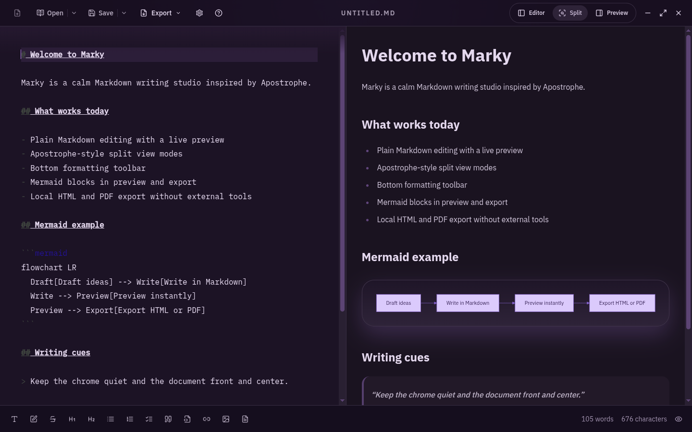

# Marky



Marky is an open source desktop Markdown editor for people who want a calm place to write.

It takes inspiration from Apostrophe on Linux, but it is being built as a cross-platform Electron app with a modern React renderer, a live preview, a practical formatting toolbar, and fully local exports to HTML and PDF. The goal is not to turn Markdown into a heavy WYSIWYG experience. The goal is to make writing in plain Markdown feel comfortable, reliable, and a little warmer.

If you are wondering why not simply contribute to Apostrophe instead: Apostrophe is a lovely project, and its GNOME-first design is part of what makes it special. But its own build instructions list `libwebkit2gtk` for rendering the preview panel, which makes it a very different foundation from the one needed for a native Windows-friendly app. Marky exists partly because building a cross-platform editor around a stack I can realistically understand, maintain, and ship is a much more honest path than pretending I can personally take on a deep Windows port of Apostrophe.

## Why Marky exists

There are plenty of Markdown tools that are either too bare, too busy, or too dependent on external tooling. Marky aims for a middle ground:

- plain Markdown first
- split-view editing that stays out of the way
- local file workflows that feel natural
- Mermaid support built into the preview and export flow
- HTML and PDF export without depending on external executables like Pandoc

## Project goals

Marky is being shaped around a few clear objectives:

- Keep the writing experience focused, calm, and human.
- Preserve Markdown as the source of truth.
- Make preview and export reliable, offline-safe, and consistent.
- Keep the codebase modular, typed, and easy to contribute to.
- Build something that feels intentionally crafted, not like a generic Electron shell.

## Current feature scope

Today, Marky is focused on the core writing workflow:

- live Markdown editing
- editor-only, preview-only, and split-view modes
- a bottom formatting toolbar for common Markdown actions
- Mermaid diagram rendering in fenced code blocks
- local open, save, and save as flows
- export to standalone HTML and PDF
- unsaved change tracking
- a custom cross-platform title bar and window controls

## Tech stack

Marky is built with:

- Electron for the desktop runtime
- React 19 and TypeScript for the UI
- CodeMirror 6 for the editing experience
- Tailwind CSS with shadcn-style component patterns for styling
- `unified`, `remark`, and `rehype` for Markdown processing
- Mermaid for diagrams in preview and export
- Zustand for lightweight client state
- `electron-vite` for development and bundling
- `electron-builder` for packaging
- ESLint, Prettier, Husky, and Commitlint for code quality

## Architecture at a glance

The app is split by process so responsibilities stay clear:

- `src/main/` handles Electron lifecycle, dialogs, file access, and export orchestration
- `src/preload/` exposes the typed IPC bridge
- `src/renderer/src/` contains the React app and feature modules
- `src/shared/` contains shared types and IPC contracts

One important detail: Marky renders export content in the renderer first, including Mermaid diagrams, and only then hands complete HTML to the main process for writing or PDF generation. That keeps exports offline-friendly and avoids external rendering dependencies.

## Getting started

### Requirements

- a recent Node.js LTS release
- npm

### Install dependencies

```bash
npm install
```

### Start the app in development

```bash
npm run dev
```

### Preview the packaged app

```bash
npm run preview
```

## Build commands

Run these from the project root:

| Command | What it does |
| --- | --- |
| `npm run build` | Type-check the project and build it with `electron-vite` |
| `npm run build:win` | Build Windows packages |
| `npm run build:mac` | Build a macOS DMG |
| `npm run build:linux` | Build Linux AppImage and Flatpak packages |
| `npm run build:all` | Build packages for all supported platforms |

### Platform notes

#### Windows

- Targets: NSIS installer and MSIX/AppX packaging
- Typical output includes `dist/win-unpacked/` and the generated installer
- Building store-ready packages may require certificates and Windows SDK tooling

#### macOS

- Requires macOS and Xcode Command Line Tools
- Builds a DMG package
- Code signing is needed for wider distribution

#### Linux

- Builds AppImage and Flatpak outputs
- Flatpak packaging requires `flatpak-builder`

## Development commands

These are the main day-to-day commands when working on Marky:

```bash
npm run lint
npm run typecheck
npm run format
npm run check
```

### AI-assisted development

Parts of this project were developed with AI assistance during implementation, iteration, and refactoring.

That said, the code, architecture decisions, and final review are my responsibility. Nothing is merged blindly, and maintainability matters more here than speed.

If you contribute, please follow the same standard: understand the code you submit, review AI-assisted output carefully, and avoid low-context or bulk-generated changes.

## Contributing

Contributions are welcome. If you want to help, small focused pull requests are the easiest place to start.

### A good contribution usually looks like this

1. Fork the repo and create a branch for your work.
2. Install dependencies with `npm install`.
3. Run `npm run dev` and make your change.
4. Run `npm run lint` and `npm run typecheck` before committing.
5. Open a pull request with a clear explanation of what changed and why.

### A few project conventions

- Keep modules focused and responsibilities narrow.
- Respect the process boundaries between `main`, `preload`, `renderer`, and `shared`.
- Keep renderer code free from direct Node APIs.
- Prefer typed IPC contracts over ad hoc messaging.
- Preserve the writing-first feel of the app when changing the UI.

### Commit quality

This repo uses Husky and Commitlint:

- pre-commit runs linting and type-checking
- commit messages are validated against conventional commit rules

That means commits like `feat: add export status feedback` or `fix: preserve preview scroll on save` will fit the existing workflow well.

## Why AGPL?

Marky is open source, and I want it to remain meaningfully open.

I chose the AGPL-3.0 license because I want improvements to this project to stay available to the community, including when the software is used over a network or offered as a hosted service.

This choice also reflects how I think about fairness in AI-assisted software development: if a project is built and shared in the open, improvements to it should remain open as well.

The goal is not to prevent use, experimentation, or contribution. The goal is to encourage reciprocity and reduce the chance of the project being taken private, lightly repackaged, and closed off from the community.

## What Marky is not trying to be

At least in its current scope, Marky is not aiming to be:

- a full rich-text editor
- a cloud sync platform
- a collaboration tool
- a plugin marketplace
- a wrapper around external export tools

## Build assets

Packaging expects app icons in `build/`:

- `build/icon.ico` for Windows
- `build/icon.icns` for macOS
- `build/icons/` for Linux PNG variants

## In short

Marky is a writing-first Markdown desktop app: local, offline-friendly, modular, and intentionally simple in the places that matter. If that sounds like your kind of tool, contributions are very welcome.


